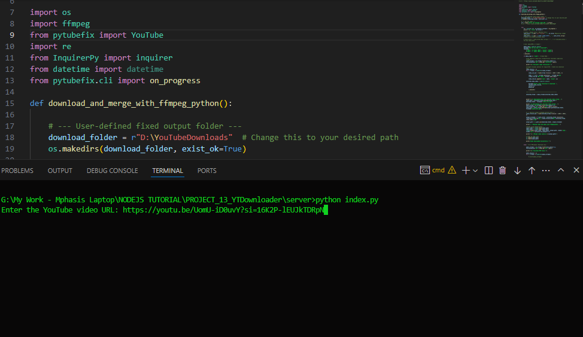
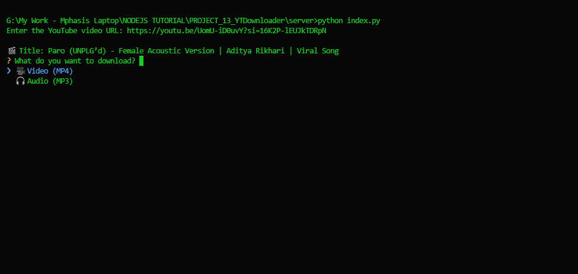
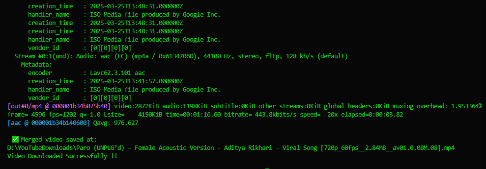

# 🎬 YouTube Downloadify – CLI Video & Audio Downloader

A simple and powerful **CLI-based YouTube Downloader App** built with **Python**.  
Supports downloading **MP4 videos** and **MP3 audio** with interactive menu selection using **InquirerPy**.

This tool uses `pytubefix` for downloading, `ffmpeg` for audio extraction, and provides real-time progress through `on_progress` hook.

---

## 🖼 Screenshots 

| Action            | Screenshot                                                                    |
| ----------------- | ----------------------------------------------------------------------------- |
| URL Enter CLI Menu|                     |
| Media Selection   |                     |
| Formate Selection |                     |
| Video Downloading |                      |
| Folder Output     |                            |


## 🚀 Features

- 🔽 Download YouTube **videos (MP4)**
- 🎵 Convert and download **audio-only (MP3)**
- 🧭 Interactive CLI menu using **InquirerPy**
- ⏳ Displays real-time progress for downloads
- 🧹 Auto-organizes downloads by date & timestamp
- 📁 Saves files cleanly using sanitized filenames
- 🖥 Works on Windows, Linux, macOS (FFmpeg required)

---

## 📦 Dependencies / Packages Used

```py
import os
import ffmpeg
from pytubefix import YouTube
import re
from InquirerPy import inquirer
from datetime import datetime
from pytubefix.cli import on_progress
```

## 🛠 Installation & Setup
1️⃣ Clone the repository
  ```
  git clone https://github.com/prakashverma-dev/Youtube-Downloadify-app.git
  cd youtube-downloadify

  ```
2️⃣ Install required Python packages
 ```

pip install pytubefix InquirerPy ffmpeg-python


```
3️⃣ Install FFmpeg

**Required for MP3 audio extraction.**

 - Windows → Download from https://ffmpeg.org/download.html

 - Linux (Ubuntu)
```
sudo apt install ffmpeg

```

- macOS
```
brew install ffmpeg
```
▶️ How to Run the App

```

python index.py

```

## 🤖 CLI Flow 
Enter the YouTube URL

1. Choose an option:

2. Download Video (MP4)

3. Download Audio (MP3)

4. The app downloads the file with progress updates

5. File saved to ./downloads/<date>/filename.mp4 or .mp3

## ⭐ Contribute / Support 

Pull requests are welcome!
If you like this project, please ⭐ star the repo on GitHub.

## 📄 License

MIT License – free to use.

## 

<h3 align="center">✨ Built with love by Prakash ❤️</h3> 

